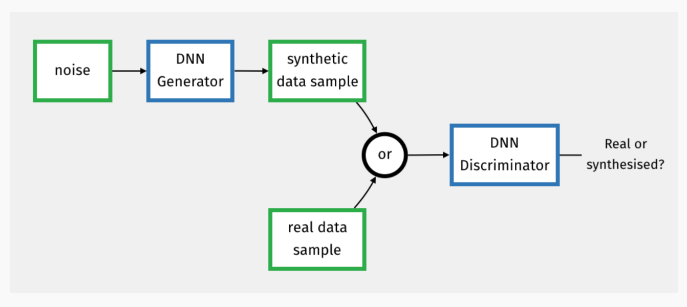

*These notes are based on slides by [François Pitié](https://francois.pitie.net/) that can be found [here](https://github.com/frcs/EE4C16/blob/master/handouts/handout-05-deep-feedforward-networks.pdf)*

# Advances in Network Architectures

## Transfer Learning

If it is not possible for you to train a state of the art network from scratch, because you only have a thousand training images, you can reuse parts of existing networks.

Generally, the initial convolutional layers in an architecture like AlexNet for image classification are for visual features while the last dense layers perform the classification based on the visual features.

Popular 'off the shelf' networks include:
* VGG
* ResNet
* GoogleNet

Because the popular off the shelf networks were trained with millions of images & thousands of classes, the trained filters produce very generic features that are relevant to most vision problems.

**Transfer Learning** is re-using parts of another network when creating a neural network.

By taking the convolutional layers from one of these architectures, you just need to design and train the classification part of the network (the last dense layers).

The more layers you redesign from the original, the more training data you will need for the network.

If you have enough samples, you might want to allow back-propogation to update some of the imported layers to be optimised for your specific application.

If you do not have enough data, you should freeze the values of the imported weights.

In most image based problems, the first thing you should consider is using one of the 'off-the-shelf' architectures because it has been shown that their generic visual features will yield state of the art performance in most applications.

---

< TODO: Explain Normalization >

A simple way of mitigating vanishing gradients is to avoid a pure sequential architecture and introduce parallel paths into the network.

An [**Inception Layer**](https://www.youtube.com/watch?v=VxhSouuSZDY) is a sub-network that produces 4 different types of convolution filters which are concatenated.

Inception layers create parallel paths, which helps with the problem of the vanishing gradient.

**Generative adversarial networks** (GANs) are a class of artificial intelligence algorithms used in unsupervised machine learning, implemented by a system of two neural networks contesting with each other in a zero-sum game framework.

A GAN's architecture is made up of:  
* A **Generator Network** which is responsible for generating fake data.
* A **Discriminator Network** which is responsible for detecting whether data is fake or real.

*"Training GANs is difficult, but the benefits are spectacular."*
